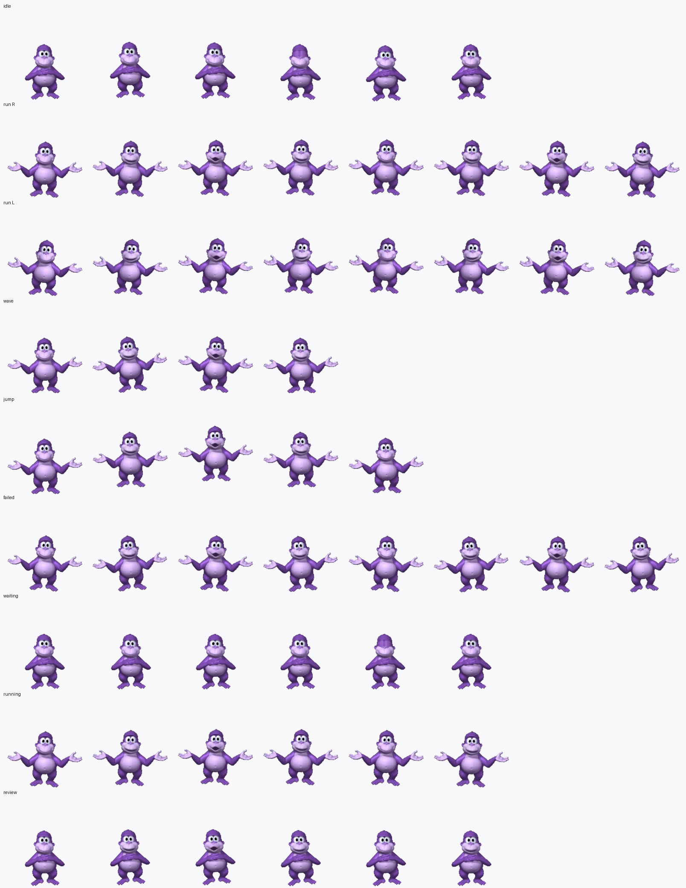

# Codex Bonzi Buddy Pet

A cheerful purple cartoon-gorilla desktop pet for the Codex desktop app, in the
classic 90s desktop-assistant style. Download, drop it in, select it. That's it.



## Install

### AI install (let Codex do it)

Paste this into Codex:

> Install a custom desktop pet for me. Create the folder `~/.codex/pets/bonzi`,
> then download these two files into it:
> - https://raw.githubusercontent.com/dturner34/codex-bonzi-buddy-pet/master/pet/bonzi/spritesheet.webp
> - https://raw.githubusercontent.com/dturner34/codex-bonzi-buddy-pet/master/pet/bonzi/pet.json
>
> Then set `selected-avatar-id = "custom:bonzi"` in my Codex config and tell me
> to restart Codex.

Asset links:
- [spritesheet.webp](https://raw.githubusercontent.com/dturner34/codex-bonzi-buddy-pet/master/pet/bonzi/spritesheet.webp)
- [pet.json](https://raw.githubusercontent.com/dturner34/codex-bonzi-buddy-pet/master/pet/bonzi/pet.json)

### Manual install

Download the two asset files above, then place them here:

```bash
mkdir -p ~/.codex/pets/bonzi
# move the downloaded files into ~/.codex/pets/bonzi/
#   spritesheet.webp
#   pet.json
```

Select "Bonzi" in the Codex pet picker, or set it directly in your Codex config:

```toml
selected-avatar-id = "custom:bonzi"
```

Restart Codex and the pet appears.

## Configure

You can change the displayed name or description by editing `pet.json`.

---

Made by [Dan Turner](https://www.linkedin.com/in/dan-turner-63997474/).
